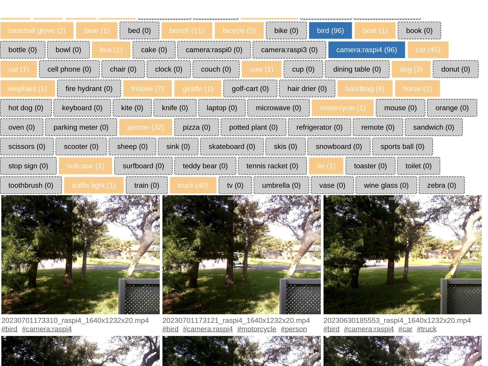
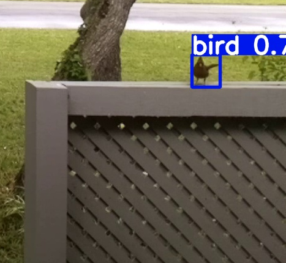

# PiMera

PiMera hopes to be an end-to-end security/critter camera application, with a web UI for browsing recordings.

The camera application runs on Raspberry Pi computers that use the Rasperry Pi camera modules. It saves H264 video whenever motion is detected within the camera frame. I'm striving for 1640x922 at 30fps (see note at end of this section), even on a Pi Zero W.

The processing scripts and video browsing UI use Python, MySQL, and JavaScript.

## Repository layout

* `mmal-version/` - This is the C code for the camera application that records when motion is detected.
* `processing/` - Scripts to copy h264 videos from camera nodes, catalog them in a database, run motion detection on them and save detected classes as tags in the database. Requirements: ffmpeg, python3
* `processing/hosts.txt` - IP addresses of the RasPis to copy videos from.
* `video-browser/` - The web UI for browsing videos by tag (detected objects) and date. **See screenshot below.** Browsing by tag works, and quick-and-dirty stream browsing does too, but I have a redesign planned to improve UX.
* `config.json` - Config file that contains MySQL connection info used by `processing/` and `video-browser/` Python code.

## Screenshots

Quick-and-dirty web UI that shows progressive filtering by tags (ie. detected objects). Numbers on each button represent number of videos with that tag and the currently selected tags ( those in dark blue).

A cardinal detected by the YOLOv8 object detection library.

## Notes

I imagine you're thinking that most people use MotionEyeOS for this purpose, and you'd be right. But I like to tinker, to learn by doing, and I enjoy writing C, so here we are.

PiMera is currently configured for 1640x922, and yes that's an odd resolution. That resolution captures using the Pi Camera module's full field-of-view. This is helpful if you don't have a wide angle lens and want to capture everything the camera is capable of seeing.

# Current Status

Very much a work in progress. The code needs many types of cleanup, but it should work for you.

For now, I'm focused on making it performant on the Pi Zero W because it's small size and low power requirements make it the perfect critter cam.

## Working Features

* 1640x922 at 20fps on Zero W
* Receives 3 frame encodings from the camera at 20fps
  * H264 - saved to disk when motion is detected
  * YUV420 - used for motion detection
  * MJPEG - for streaming/live-viewing to a web browser
* Motion detection 3x per second
* MJPEG streaming to browser at 2fps (planning more optimizations here)
* CPU utilization of Pi Zero W stays under 15% even when streaming to browser
* Frame annotated with timestamp and hostname
* Configurable via INI file (resolution, fps, video save path, etc)
* User specifies a rectangular region of the frame to check for motion in the INI

## Features in Progress

* Motion Detection should use SIMD when possible
* Hoping to get to 30fps

## Supported Hardware

I'm developing and testing with:

* Raspberry Pi Zero W
* Pi Camera module v2
* 32bit PiOS
* Clang

# Installation

## Prerequisites

* Raspberry Pi Zero W, 3B+, or 4
* Pi Camera module
* 32bit Raspberry Pi OS Lite. No desktop needed, since want to preserve all CPU and RAM for pimera to keep things performant
* apt install clang

## Setup

Using `raspi-config`, set up your network, enable SSH, enable the legacy camera module.

Note the IP address of your Pi when it connects to your network.

## Building

* In `mmal-version/src/`, run `make`

## Running

In `mmal-version/` run `pimera`.

Open `http://YOUR_PI_IP:8080` in your browser. You should see a 2fps stream.

The defaults in `mmal-version/settings.ini` should work fine for the first test.

# History

This is not entirely a new project. I created a similar project in Python 3 many years ago, see the [raspi-hd-surveillance](https://github.com/alanszlosek/raspi-hd-surveillance) GitHub repository. However, I had a hunch I could squeeze out more performance so about two years ago I started re-writing it in C using MMAL. 

Cruel twist: Raspberry Pi is [moving away](https://www.raspberrypi.com/documentation/accessories/camera.html) from the proprietary Broadcom camera stack to the open source [libcamera](https://libcamera.org) library. I've created a partially working prototype of a version that uses libcamera instead of MMAL, but it needs more polish.

----

OLD PORTION OF README FOCUSED ON LIBCAMERA VERSION

## libcamera version

If you would like to watch me build this project, check out my [PiMera YouTube playlist](https://www.youtube.com/watch?v=joc-nHM-NFU&list=PLGonE3T1sorRArqmtf22yUj0KgO2FpFvG).

I'm still getting comfortable with libcamera, but am hoping things will go faster once I can begin porting my Python code to C.

# Features

* Motion detection
    * Can specify which regions of the frame to check for motion (allows you to exclude swaying trees, etc)
    * Motion detected when N% of pixels have changed (configurable)
* Live streaming to browser using MJPEG format
* When motion is detected, record to h264 files (portable-ish)
* Striving for efficient code that can support 1080p 30fps

# Installation

## Pre-requisites

* Raspberry Pi 3B+ or 4B (haven't tested)
* Raspberry Pi OS, based on Debian 11 or later
* apt install clang libcamera-dev libjpeg62-turbo-dev

## Building

* In `src/`, run `make`
* Code has hardcoded defaults. Haven't implemented loading settings from file yet.

# Using libcamera

If you're new to libcamera like I am, check out the `examples/libcamera-scaffold` directory. There you will find `scaffold.cpp` and a `Makefile` for building (possibly) the simplest possible libcamera app.

It configures the camera, registers a callback, receives frames via the callback function, then exits after 10 seconds.
